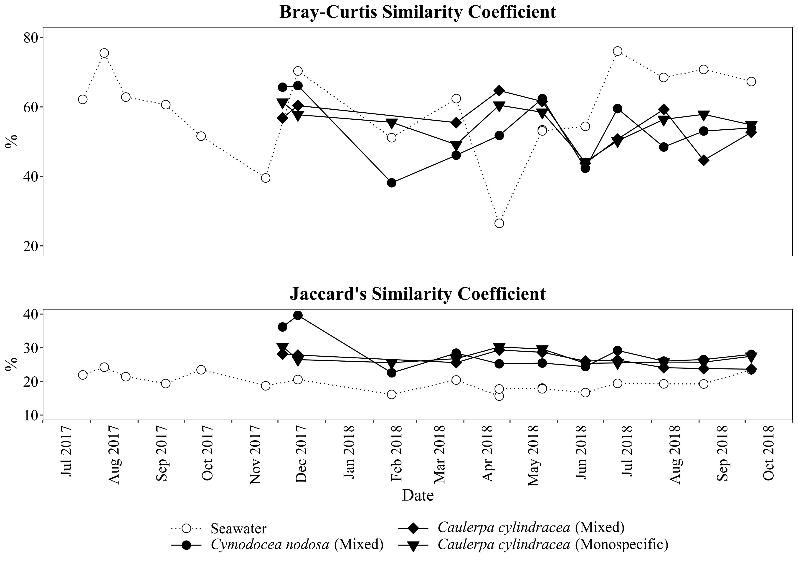
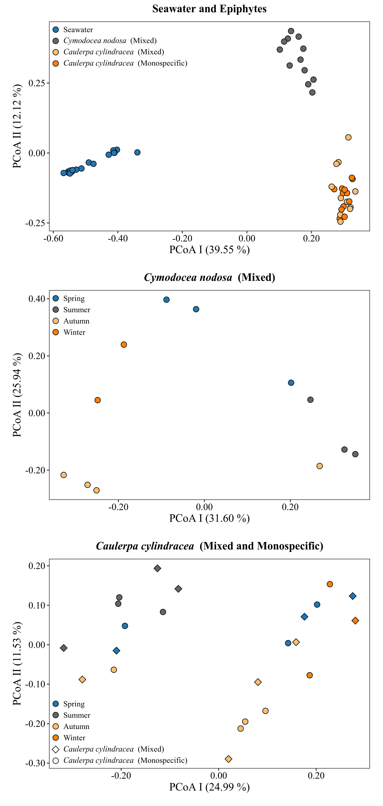

```{r knitr_settings, eval=TRUE, echo=FALSE, cache=FALSE}
opts_chunk$set("tidy" = TRUE)
opts_chunk$set("echo" = FALSE)
opts_chunk$set("eval" = TRUE)
opts_chunk$set("warning" = FALSE)
opts_chunk$set("cache" = T)
opts_chunk$set("message" = FALSE)

inline_hook <- function(x){
	print(x)

	if(is.list(x)){
		x <- unlist(x)
	}

	if(is.numeric(x)){
		if(abs(x - round(x)) < .Machine$double.eps^0.5){
			paste(format(x,big.mark=',', digits=0, scientific=FALSE))
		} else {
			paste(format(x,big.mark=',', digits=1, nsmall=1, scientific=FALSE))
		}
	} else {
    	paste(x)      
	}
}
knitr::knit_hooks$set(inline=inline_hook)
```

\vspace{70mm}

^1$\dagger$^

\vspace{40mm}

$\dagger$ To whom correspondence should be addressed: marino.korlevic@irb.hr


1\. Ruđer Bošković Institute, Center for Marine Research, G. Paliaga 5, Rovinj, Croatia

2\. University of Vienna, Department of Limnology and Bio-Oceanography, Althanstraße 14, Vienna, Austria
\newpage
\linenumbers
\sisetup{mode=text}
\setlength\parindent{24pt}

## Abstract


\newpage
## Introduction
Marine macrophytes (seagrasses and macroalgae) are important ecosystem engineers that form close associations with microorganism belonging to all three domains of life [@Tarquinio2019; @Egan2013]. Microbes can live within macrophyte tissue as endophytes or can form epiphytic communities on surfaces of leaves and thalli [@Tarquinio2019; @Egan2013; @Hollants2013]. Epiphytic and endophytic microbial communities form a close functional relationship with the macrophyte host. It was proposed that this close relationship constitutes a holobiont, an integrated community where the macrophyte organism and its symbiotic partners support each other [@Margulis1991; @Tarquinio2019; @Egan2013].

Biofilms formed from microbial epiphytes can contain diverse taxonomic groups and harbor cell densities from 10^2^ to 10^7^ \si{\cells\per\cm\squared} [@Armstrong2000; @Bengtsson2010; @Burke2011b]. In such an environment a number of positive and negative interactions between the macrophyte and colonizing microorganisms have been described [@Tarquinio2019; @Egan2013; @Hollants2013]. Macrophytes can promote growth of associated microbes by nutrient exudation, while in return microorganisms may support macrophyte performance through improved nutrient availability, phytohormone production and protection form toxic compounds, oxidative stress, biofouling organisms and pathogens [@Tarquinio2019; @Egan2013; @Hollants2013]. Beside this positive interactions, macrophytes can  negatively impact the associated microbes such as pathogenic bacteria by producing reactive oxygen species and secondary metabolites [@Tarquinio2019; @Egan2013; @Hollants2013].

All these ecological roles are carried out by a taxonomically diverse community of microorganisms. At higher taxonomic ranks a core set of macrophyte epiphytic taxa was described consisting mainly of *Alphaproteobacteria*, *Gammaproteobacteria*, *Desulfobacterota*, *Bacteroidota*, *Cyanobacteria*, *Actinobacteriota*, *Firmicutes*, *Planctomycetota*, *Chloroflexi* and *Verrucomicrobiota* [@Lachnit2011; @Crump2008; @Tujula2010]. In contrast, at lower taxonomic ranks host specific microbial communities were described [@Roth-Schulze2016; @Lachnit2011]. Recently, it was shown that even different morphological niches within the same alga had a higher influence on bacterial community variation than biogeography or environmental factors [@Morrissey2019]. While there is high community variation between host species is was observed that the majority of metagenome determined functions were conserved both between host species and individuals [@Burke2011a; @Roth-Schulze2016]. This discrepancy between taxonomic and functional composition could be explained by the lottery hypothesis. It postulates that an initial random colonization step is performed from a set of functionally equivalent taxonomic groups resulting in taxonomically different epiphytic communities sharing a core set of functional genes [@Burke2011a; @Roth-Schulze2016]. In addition, some of the variation in the observed data could be attributed to different techniques used in various studies, such as different protocols for epiphytic cell detachment and/or DNA isolation, as no standard protocol to study epiphytic communities was established [@Ugarelli2019; @Korlevic_in_press, submitted].    

The majority of studies describing macrophyte epiphytic communities did not encompass seasonal changes [@Ugarelli2019; @Lachnit2009; @Crump2008; @Burke2011b; @Roth-Schulze2016]. In addition, if seasonal changes were taken into account low temporal frequency and/or methodologies that do not allow for high taxonomic resolution were used [@Tujula2010; @Lachnit2011; @Miranda2013]. In the present study we describe the seasonal dynamics of bacterial and archaeal communities on the surfaces of the seagrass *Cymodocea nodosa* and siphonous macroalgae *Caulerpa cylindracea* determined on a mostly monthly scale. Bacterial and archaeal epiphytes were sampled in a meadow of *Cymodocea nodosa* invaded by the invasive *Caulerpa cylindracea* and in a locality of only *Caulerpa cylindracea* located in the proximity of the meadow. In addition, for comparison, the community of the surrounding seawater was characterized.

\newpage
## Materials and Methods
### Sampling
Leaves of *Cymodocea nodosa* were sampled in a *Cymodocea nodosa* meadow located in the proximity of the village of Funtana (\ang{45;10;39} N, \ang{13;35;42} E). Thalli of *Caulerpa cylindracea* were sampled in the same *Cymodocea nodosa* invaded meadow in Funtana and on a locality of only *Caulerpa cylindracea* located close to the invaded meadow. Sampling of leaves and thalli was performed approximately monthly from December 2017 to October 2018 (\autoref{supp-nseq_notus}). Leaves and thalli were collected by diving and transported to the laboratory in containers placed on ice and filled with site seawater. Upon arrival to the laboratory, *Cymodocea nodosa* leaves were cut into sections of 1 -- 2 \si{\cm}, while *Caulerpa cylindracea* thalli were cut into 5 -- 8 \si{\cm} long sections. Leaves and thalli were washed three times with sterile artificial seawater (ASW) to remove loosely attached microbial cells. Surrounding seawater was collected in 10 \si{\l} containers by diving and transported to the laboratory where the whole container volume was filtered through a 20 \si{\um} net. The filtrate was further sequentially filtered through 3 \si{\um} and 0.2 \si{\um} polycarbonate membrane filters (Whatman, United Kingdom) using a peristaltic pump. Filters were briefly dried at room temperature and stored at \num{-80} \si{\degreeCelsius}. Seawater samples were also collected approximately monthly from July 2017 to October 2018.

### DNA Isolation
DNA from surfaces of *Cymodocea nodosa* and *Caulerpa cylindracea* was isolated using a previously modified and adapted protocol that allows for a selective epiphytic DNA isolation [@Korlevic_in_press, submitted; @Massana1997]. Briefly, leaves and thalli are incubated in a lysis buffer and treated with lysozyme and proteinase K. Following the incubations, the mixture containing lyzed epiphytic cells is separated from leaves and thalli and extracted using a phenol-chloroform procedure. Finally, the extracted DNA is precipitated using isopropanol. DNA from seawater picoplankton was isolated from 0.2 \si{\um} polycarbonate filters according to [@Massana1997] with a slight modification. Following the phenol-chloroform extraction steps 1/10 of chilled 3 \si{\Molar} sodium acetate (pH 5.2) was added. DNA was precipitated by adding 1 volume of chilled isopropanol, incubating the mixtures overnight at \num{-20} \si{\degreeCelsius} and centrifuging at 20,000 × g and 4 \si{\degreeCelsius} for 21 \si{\minute}. The pellet was washed twice with 500 \si{\ul} of chilled 70 \si{\percent} ethanol and centrifuged after each washing step at 20,000 × g and 4 \si{\degreeCelsius} for 5 \si{\minute}. Dried pellets were resuspended in 50 -- 100 \si{\ul} of deionized water.

### Illumina 16S rRNA Sequencing
Illumina MiSeq sequencing of the V4 16S rRNA region was performed as described previously [@Korlevic_in_press, submitted]. The V4 region of the 16S rRNA gene was amplified using a two-step PCR procedure. In the first PCR the 515F (5'-GTGYCAGCMGCCGCGGTAA-3') and 806R (5'-GGACTACNVGGGTWTCTAAT-3') primers from the Earth Microbiome Project (http://press.igsb.anl.gov/earthmicrobiome/protocols-and-standards/16s/) were used [@Caporaso2012; @Apprill2015; @Parada2016]. These primers contained on their 5' end a tagged sequence. Purified PCR products were sent for Illumina MiSeq sequencing at IMGM Laboratories, Martinsried, Germany. Before sequencing at IMGM, the second PCR amplification of the two-step PCR procedure was performed using primers targeting the tagged region incorporated in the first PCR. In addition, these primers contained adapter and sample-specific index sequences. Beside samples, a positive and negative control for each sequencing batch was sequenced. Negative control was comprised of PCR reactions without DNA template, while for a positive control a mock community composed of evenly mixed DNA material originating from 20 bacterial strains (ATCC MSA-1002, ATCC, USA) was used. The sequences obtained in this study have been submitted to the European Nucleotide Archive (ENA) under accession numbers **TO BE ADDED LATER!**.

### Sequence Analysis
```{r error}
# Calculation of the error rate based on the ATCC MSA-1002 mock community
error <- read_tsv("data/mothur/raw.trim.contigs.good.unique.good.filter.unique.precluster.pick.pick.pick.error.summary", na="") %>%
  filter(numparents==1) %>%
  mutate(mismatches_weight=weight*mismatches) %>%
  mutate(total_weight=weight*total)
error <- sum(error$mismatches_weight)/sum(error$total_weight)*100

# Calculation of the number of sequences in the negative control
nc <- read_tsv("data/mothur/raw.trim.contigs.good.unique.good.filter.unique.precluster.pick.nr_v138.wang.tax.summary") %>%
  filter(taxon=="Root") %>%
  select(NC_1)
```

Obtained sequences were analyzed on the computer cluster Isabella (University Computing Center, University of Zagreb) using mothur (version 1.43.0) [@Schloss2009] according to the MiSeq Standard Operating Procedure (MiSeq SOP; https://mothur.org/wiki/MiSeq_SOP) [@Kozich2013] and recommendations given from the Riffomonas project to enhance data reproducibility (http://www.riffomonas.org/). For alignment and classification of sequences the SILVA SSU Ref NR 99 database (release 138; http://www.arb-silva.de) was used [@Quast2013; @Yilmaz2014]. Pipeline data processing and visualization was done using R (version 3.6.0) [@RCoreTeam2019],  packages  vegan (version 2.5-6) [@Oksanen2019], and tidyverse (version 1.3.0) [@Wickham2019] and multiple other packages [@Xie2014; @Xie2015; @Xie2019a; @Xie2019; @Xie2020; @Allaire2019; @Xie2018; @Zhu2019; @Neuwirth2014]. The detailed analysis procedure including the R Markdown file for this paper are available as a GitHub repository (**TO BE ADDED LATER!**). Based on the ATCC MSA-1002 mock community included in the analysis an average sequencing error rate of `r error` \si{\percent} was determined, which is in line with previously reported values for next-generation sequencing data [@Kozich2013; @Schloss2016]. In addition, the negative controls processed together with the samples yielded on average only `r nc` sequences after sequence quality curation.

## Results

```{r community}
# Loading input data containing sequence abundances and subsequent input data customization
community <- read_tsv("data/mothur/raw.trim.contigs.good.unique.good.filter.unique.precluster.pick.nr_v138.wang.tax.summary") %>%
  filter(!str_detect(taxon, "^Eukaryota")) %>%
  filter(taxon!="Root")

# Remove chloroplast and mitochondrial sequences and subtract their number from higher taxonomic levels to which
# they belong
chloroplast <- filter(community, str_detect(taxon, "^Chloroplast$"))$rankID
mitochondria <- filter(community, str_detect(taxon, "^Mitochondria$"))$rankID

community <- mutate_at(community, 5:ncol(community), list(~case_when(
    rankID==str_extract(chloroplast, "(\\d+\\.){3}\\d+") ~ . - .[taxon=="Chloroplast"],
    rankID==str_extract(chloroplast, "(\\d+\\.){2}\\d+") ~ . - .[taxon=="Chloroplast"],
    rankID==str_extract(chloroplast, "(\\d+\\.){1}\\d+") ~ . - .[taxon=="Chloroplast"],
  TRUE ~ .))) %>%
  filter(!str_detect(taxon, "^Chloroplast")) %>%
  mutate_at(5:ncol(.), list(~case_when(
    rankID==str_extract(mitochondria, "(\\d+\\.){4}\\d+") ~ . - .[taxon=="Mitochondria"],
    rankID==str_extract(mitochondria, "(\\d+\\.){3}\\d+") ~ . - .[taxon=="Mitochondria"],
    rankID==str_extract(mitochondria, "(\\d+\\.){2}\\d+") ~ . - .[taxon=="Mitochondria"],
    rankID==str_extract(mitochondria, "(\\d+\\.){1}\\d+") ~ . - .[taxon=="Mitochondria"],
    TRUE ~ .))) %>%
  filter(!str_detect(taxon, "^Mitochondria")) %>%
  select(-ATCC_1, -ATCC_5, -NC_1)

# Calculating the number of sequencing in millions
million_sequences <- filter(community, taxon=="Archaea" | taxon=="Bacteria") %>%
  select(total) %>%
  sum()/1e6

# Loading metadata
metadata <- read_tsv("data/raw/metadata.csv")

# Calculating number of samples
samples_epiphytes <- filter(metadata, !is.na(station) & station!="F") %>%
  summarise(n=n())
samples_seawater <- filter(metadata, !is.na(station) & station=="F") %>%
  summarise(n=n())

# Calculating the minimal and maximal number of sequences
min_max <- filter(community, taxon=="Archaea" | taxon=="Bacteria") %>%
  summarise_at(6:ncol(.), sum) %>%
  summarise(min=min(.), max=max(.))

# Calculating the relative abundance of Archaea and Bacteria
archaea_bacteria <- filter(community, taxon=="Archaea" | taxon=="Bacteria") %>%
  mutate_at(5:ncol(.), list(~. / sum(.) * 100)) %>%
  gather(key="Group", value="abundance", 6:(ncol(.))) %>%
  group_by(taxon) %>%
  summarise(mean=mean(abundance), sd=sd(abundance))
```

```{r shared}
# Loading OTU/sample data
shared <- read_tsv("data/mothur/raw.trim.contigs.good.unique.good.filter.unique.precluster.pick.pick.pick.opti_mcc.shared")

# Calculating the number of OTUs before rarefaction
no_otus <- select(shared, starts_with("Otu")) %>%
  colnames() %>%
  length()

# Generation of random rarefied community data
rarefied <- shared %>%
  select(-label, -Group, -numOtus) %>%
  rrarefy(., min(rowSums(.))) %>%
  as_tibble() %>%
  add_column("Group"=shared$Group, .before=TRUE) %>%
  select_if(list(~ !is.numeric(.) || sum(.)!=0))

# Calculating the number of OTUs after rarefaction
no_otus_rarefied <- select(rarefied, starts_with("Otu")) %>%
  colnames() %>%
  length()

# Calculating the maximal and minimal number of OTUs after rarefaction
otu_min_max <- select(rarefied, starts_with("Otu")) %>%
  decostand(., method="pa") %>%
  transmute(sum=rowSums(.))
```

```{r calculators}
# Copying the sample labels to the rows (input for library vegan)
row.names(rarefied) <- rarefied$Group

# Removing column containing sample labels
rarefied <- rarefied %>%
  select(-Group)

# Calculating Chao1 and ACE species estimators
estimators <- estimateR(rarefied)
estimators <- as_tibble(t(estimators)) %>%
  add_column("Group"=colnames(estimators), .before=TRUE)

# Calculating diversity indices
shannon <- diversity(rarefied, index="shannon")
shannon <- tibble(Group=names(shannon), shannon)
invsimpson <- diversity(rarefied, index="invsimpson")
invsimpson <- tibble(Group=names(invsimpson), invsimpson)

# Transforming the Shannon entropy to the effective number of species
# (http://www.loujost.com/Statistics%20and%20Physics/Diversity%20and%20Similarity/EffectiveNumberOfSpecies.htm)
shannon <- mutate(shannon, shannon=exp(shannon)) %>%
  rename(eshannon=shannon)

# Joining together estimators and indices
estimators_indices <- inner_join(estimators, shannon, by="Group") %>%
  inner_join(., invsimpson, by="Group")

# Loading metadata 
metadata <- read_tsv("data/raw/metadata.csv")

# Joining metadata with estimators and indices
estimators_indices_metadata <- inner_join(metadata, estimators_indices, by=c("ID"="Group")) %>%
  mutate(date=as.Date(date, "%d.%m.%Y"))

# Calculating the mean and standard deviation for each environment
S.obs_f <- filter(estimators_indices_metadata, station=="F") %>%
  summarise(mean=mean(S.obs), sd=sd(S.obs))
S.obs_fcym <- filter(estimators_indices_metadata, station=="FCyM") %>%
  summarise(mean=mean(S.obs), sd=sd(S.obs))
S.obs_fcam <- filter(estimators_indices_metadata, station=="FCaM") %>%
  summarise(mean=mean(S.obs), sd=sd(S.obs))
S.obs_fca <- filter(estimators_indices_metadata, station=="FCa") %>%
  summarise(mean=mean(S.obs), sd=sd(S.obs))

# Calculating the mean and standard deviation for each environment and season
S.obs_season_f <- filter(estimators_indices_metadata, station=="F") %>%
  group_by(season) %>%
  summarise(mean_S.obs=mean(S.obs), sd_S.obs=sd(S.obs),
            mean_S.chao1=mean(S.chao1), sd_S.chao1=sd(S.chao1),
            mean_S.ACE=mean(S.ACE), sd_S.ACE=sd(S.ACE),
            mean_eshannon=mean(eshannon), sd_eshannon=sd(eshannon),
            mean_invsimpson=mean(invsimpson), sd_invsimpson=sd(invsimpson))
S.obs_season_fcym <- filter(estimators_indices_metadata, station=="FCyM") %>%
  group_by(season) %>%
  summarise(mean_S.obs=mean(S.obs), sd_S.obs=sd(S.obs),
            mean_S.chao1=mean(S.chao1), sd_S.chao1=sd(S.chao1),
            mean_S.ACE=mean(S.ACE), sd_S.ACE=sd(S.ACE),
            mean_eshannon=mean(eshannon), sd_eshannon=sd(eshannon),
            mean_invsimpson=mean(invsimpson), sd_invsimpson=sd(invsimpson))
S.obs_season_fcam <- filter(estimators_indices_metadata, station=="FCaM") %>%
  group_by(season) %>%
  summarise(mean_S.obs=mean(S.obs), sd_S.obs=sd(S.obs),
            mean_S.chao1=mean(S.chao1), sd_S.chao1=sd(S.chao1),
            mean_S.ACE=mean(S.ACE), sd_S.ACE=sd(S.ACE),
            mean_eshannon=mean(eshannon), sd_eshannon=sd(eshannon),
            mean_invsimpson=mean(invsimpson), sd_invsimpson=sd(invsimpson))
S.obs_season_fca <- filter(estimators_indices_metadata, station=="FCa") %>%
  group_by(season) %>%
  summarise(mean_S.obs=mean(S.obs), sd_S.obs=sd(S.obs),
            mean_S.chao1=mean(S.chao1), sd_S.chao1=sd(S.chao1),
            mean_S.ACE=mean(S.ACE), sd_S.ACE=sd(S.ACE),
            mean_eshannon=mean(eshannon), sd_eshannon=sd(eshannon),
            mean_invsimpson=mean(invsimpson), sd_invsimpson=sd(invsimpson))
```

Sequencing of the 16S rRNA V4 region yielded a total of `r million_sequences` million sequences after quality curation and exclusion of eukaryotic, chloroplast, mitochondrial and no relative sequences (\autoref{supp-nseq_notus}). A total of `r samples_epiphytes` samples originating from epiphytic archaeal and bacterial communities associated with surfaces of the seagrass *Cymodocea nodosa* and macroalga *Caulerpa cylindracea* were analyzed. In addition, `r samples_seawater` samples (one of the samples was sequenced two times) originating from picoplankton archaeal and bacterial communities in the surrounding seawater were also processed. The number of reads per sample ranged between `r min_max$min` and `r min_max$max` sequences (\autoref{supp-nseq_notus}). Even when the highest sequencing effort was applied the rarefaction curves did not level off that is a common observation in high-throughput 16S rRNA amplicon sequencing approaches (\autoref{supp-rarefaction}). Following quality curation and exclusion of sequences mentioned before reads were clustered into `r no_otus` different OTUs at a similarity level of 97 \si{\percent}. Reads numbers were normalized to the minimum number of sequences, `r min_max$min` (\autoref{supp-nseq_notus}), through rarefaction resulting in `r no_otus_rarefied` different OTUs that ranged from `r min(otu_min_max)` to `r max(otu_min_max)` OTUs per sample (\autoref{supp-calculators}). To determine seasonal changes of richness and diversity the Observed Number of OTUs, Chao1, ACE, Exponential Shannon [@Jost2006] and Inverse Simpson were calculated after normalization through rarefaction. Generally, richness estimators and diversity indices showed similar trends. On average, higher values were found for *Caulerpa cylindracea* (invaded [Number of OTUs, `r S.obs_fcam$mean` ± `r S.obs_fcam$sd` OTUs] and noninvaded [Number of OTUs, `r S.obs_fca$mean` ± `r S.obs_fca$sd` OTUs]), middle vales for *Cymodocea nodosa* (Number of OTUs, `r S.obs_fcym$mean` ± `r S.obs_fcym$sd` OTUs) and lower values for picoplankton communities in the surrounding seawater (Number of OTUs, `r S.obs_f$mean` ± `r S.obs_f$sd` OTUs) (\autoref{supp-calculators}). Seasonal changes did not show such large dissimilarities. Seawater communities richness was stable during the studied period with the exception of one sampling point in December 2017 when larger values were observed. *Cymodocea nodosa* communities showed a slow increase towards the end of the study, while *Caulerpa cylindracea* (invaded and noninvaded) communities were characterized by slightly larger values in Spring and Summer in comparison to Autumn and Winter (\autoref{supp-calculators}).

```{r seasonal_shared}
# Generation of random rarefied community data
rarefied <- shared %>%
  select(-label, -Group, -numOtus) %>%
  rrarefy(., min(rowSums(.))) %>%
  as_tibble() %>%
  add_column("Group"=shared$Group, .before=TRUE) %>%
  select_if(list(~ !is.numeric(.) || sum(.)!=0))

# Loading metadata 
metadata <- read_tsv("data/raw/metadata.csv")

# Joining metadata with OTU/sample data and summing sequences from each environment
rarefied_metadata <- inner_join(rarefied, metadata, by=c("Group"="ID")) %>%
  mutate(date=as.Date(date, "%d.%m.%Y")) %>%
  filter(date >= "2017-11-01") %>%
  select_if(list(~ !is.numeric(.) || sum(.)!=0)) %>%
  group_by(station) %>%
  select(starts_with("Otu")) %>%
  summarise_all(sum)

# Copying the sample labels to the rows (input for library vegan)
row.names(rarefied_metadata) <- rarefied_metadata$station

# Removing column containing sample labels
rarefied_metadata <- rarefied_metadata %>%
  select(-station)

# Calculating matrices of similarity indices
jaccard <- vegdist(rarefied_metadata, method="jaccard", binary=T)
jaccard <- as_tibble(data.frame(t(combn(rownames(rarefied_metadata), 2)), as.numeric(jaccard))) %>%
  rename(V1=X1, V2=X2, jaccard=as.numeric.jaccard.)

bray <- vegdist(rarefied_metadata, method="bray", binary=F)
bray <- as_tibble(data.frame(t(combn(rownames(rarefied_metadata), 2)), as.numeric(bray))) %>%
  rename(V1=X1, V2=X2, bray=as.numeric.bray.)

similarity <- inner_join(jaccard, bray, by=c("V1"="V1", "V2"="V2")) %>%
  mutate(jaccard=1-jaccard) %>%
  mutate(bray=1-bray)
```

```{r anosim}
# Generation of random rarefied community data and preserving sample names as row names
rarefied <- shared %>%
  select(-label, -Group, -numOtus) %>%
  rrarefy(., min(rowSums(.))) %>%
  as_tibble() %>%
  select_if(list(~!is.numeric(.) || sum(.)!=0))
rownames(rarefied) <- shared$Group
rarefied <- rarefied %>%
  add_column("Group"=shared$Group, .before=TRUE)

# Loading metadata 
metadata_rarefied <- read_tsv("data/raw/metadata.csv") %>%
  inner_join(., rarefied, by=c("ID"="Group"))

# Calculating ANOSIM
metadata_rarefied_select <- metadata_rarefied %>%
  select(starts_with("Otu"))
grouping <- metadata_rarefied %>%
  mutate(grouping=str_replace(station, "CaM$", "Ca"))
anosim_all <- anosim(metadata_rarefied_select, grouping$grouping, permutations=1000, distance="bray")
anosim_all_signif <- case_when(anosim_all$signif < 0.05 & anosim_all$signif >= 0.01 ~ 0.05,
                               anosim_all$signif < 0.01 & anosim_all$signif >= 0.001 ~ 0.01,
                               anosim_all$signif < 0.001 & anosim_all$signif >= 0.0001 ~ 0.001,
                               anosim_all$signif < 0.0001 ~ 0.0001,
                               TRUE ~ anosim_all$signif)

metadata_rarefied_select <- metadata_rarefied %>%
  filter(station=="F") %>%
  select(starts_with("Otu"))
grouping <- metadata_rarefied %>%
  filter(station=="F") %>%
  mutate(grouping=str_replace(season, "Autumn", "Winter"))
anosim_f <- anosim(metadata_rarefied_select, grouping$grouping, permutations=1000, distance="bray")
anosim_f_signif <- case_when(anosim_f$signif < 0.05 & anosim_f$signif >= 0.01 ~ 0.05,
                             anosim_f$signif < 0.01 & anosim_f$signif >= 0.001 ~ 0.01,
                             anosim_f$signif < 0.001 & anosim_f$signif >= 0.0001 ~ 0.001,
                             anosim_f$signif < 0.0001 ~ 0.0001,
                             TRUE ~ anosim_f$signif)

metadata_rarefied_select <- metadata_rarefied %>%
  filter(station=="FCyM") %>%
  select(starts_with("Otu"))
grouping <- metadata_rarefied %>%
  filter(station=="FCyM") %>%
  mutate(grouping=str_replace(season, "Autumn", "Winter"))
anosim_fcym <- anosim(metadata_rarefied_select, grouping$grouping, permutations=1000, distance="bray")
anosim_fcym_signif <- case_when(anosim_fcym$signif < 0.05 & anosim_fcym$signif >= 0.01 ~ 0.05,
                                anosim_fcym$signif < 0.01 & anosim_fcym$signif >= 0.001 ~ 0.01,
                                anosim_fcym$signif < 0.001 & anosim_fcym$signif >= 0.0001 ~ 0.001,
                                anosim_fcym$signif < 0.0001 ~ 0.0001,
                                TRUE ~ anosim_fcym$signif)

metadata_rarefied_select <- metadata_rarefied %>%
  filter(station=="FCaM" | station=="FCa") %>%
  select(starts_with("Otu"))
grouping <- metadata_rarefied %>%
  filter(station=="FCaM" | station=="FCa") %>%
  mutate(grouping=str_replace(season, "Autumn", "Winter")) %>%
  mutate(grouping=str_replace(grouping, "Spring", "Winter"))
anosim_fca <- anosim(metadata_rarefied_select, grouping$grouping, permutations=1000, distance="bray")
anosim_fca_signif <- case_when(anosim_fca$signif < 0.05 & anosim_fca$signif >= 0.01 ~ 0.05,
                                anosim_fca$signif < 0.01 & anosim_fca$signif >= 0.001 ~ 0.01,
                                anosim_fca$signif < 0.001 & anosim_fca$signif >= 0.0001 ~ 0.001,
                                anosim_fca$signif < 0.0001 ~ 0.0001,
                                TRUE ~ anosim_fca$signif)
```

To determine the proportion of shared archaeal and bacterial OTUs and communities sampled in different environments the Jaccard's Similarity Coefficient on presence-absence data and Bray-Curtis Similarity Coefficient were, respectively, calculated. Coefficients were determined after normalization through rarefaction and binning of samples from a particular environment. The highest proportion of shared OTUs and community was found between invaded and noninvaded  *Caulerpa cylindracea* (Jaccard, `r format(filter(similarity, V1=="FCa", V2=="FCaM")$jaccard, digits=2, nsmall=2)`; Bray-Curtis, `r format(filter(similarity, V1=="FCa", V2=="FCaM")$bray, digits=2, nsmall=2)`), while lower shared values were calculated between seawater and epiphytic communities (\autoref{matrix}). Shared proportion between *Cymodocea nodosa* and *Caulerpa cylindracea* were approximately in the middle between these two extremes. To assess seasonal changes in the proportion of shared OTUs and communities the Jaccard's and Bray-Curtis Similarity Coefficients were calculated between consecutive sampling points (\autoref{shared}). Both coefficients showed similar trends. Temporal proportional changes were more pronounced for seawater in comparison to *Cymodocea nodosa* and especially *Caulerpa cylindracea* associated communities (\autoref{shared}). To further disentangle the environmental and seasonal community dissimilarity a Principal Coordinates Analysis (PCoA) based on Bray-Curtis distances and OTU abundances was applied. It showed a clear separation between planktonic and surface associated communities (\autoref{pcoa}). In addition, a separation of epiphytic bacterial and archaeal communities based on host species was determined. This separation was further supported by ANOSIM (R = `r format(anosim_all$statistic, digits=2, nsmall=2)`, *p* < `r anosim_all_signif`). Seasonal changes of seawater communities indicated a separation between Spring, Summer and Autumn/Winter samples (ANOSIM, R = `r format(anosim_f$statistic, digits=2, nsmall=2)`, *p* < `r anosim_f_signif`). Epiphytic microbial communities associated with *Cymodocea nodosa* showed a similar pattern (ANOSIM, R = `r format(anosim_fcym$statistic, digits=2, nsmall=2)`, *p* < `r anosim_fcym_signif`), while communities from the surfaces of *Caulerpa cylindracea* indicated a non so strongly supported, as in previous cases, separation between Summer and Autumn/Winter/Spring samples (ANOSIM, R = `r format(anosim_fca$statistic, digits=2, nsmall=2)`, *p* < `r anosim_fca_signif`) (\autoref{pcoa}).

```{r chloroplast}
# Loading input data containing sequence abundances and subsequent input data customization
community <- read_tsv("data/mothur/raw.trim.contigs.good.unique.good.filter.unique.precluster.pick.nr_v138.wang.tax.summary") %>%
  filter(!str_detect(taxon, "^Eukaryota")) %>%
  filter(taxon!="Root")

# Remove mitochondrial sequences and subtract their number from higher taxonomic levels to which
# they belong
mitochondria <- filter(community, str_detect(taxon, "^Mitochondria$"))$rankID
community <- mutate_at(community, 5:ncol(community), list(~case_when(
    rankID==str_extract(mitochondria, "(\\d+\\.){4}\\d+") ~ . - .[taxon=="Mitochondria"],
    rankID==str_extract(mitochondria, "(\\d+\\.){3}\\d+") ~ . - .[taxon=="Mitochondria"],
    rankID==str_extract(mitochondria, "(\\d+\\.){2}\\d+") ~ . - .[taxon=="Mitochondria"],
    rankID==str_extract(mitochondria, "(\\d+\\.){1}\\d+") ~ . - .[taxon=="Mitochondria"],
    TRUE ~ .))) %>%
  filter(!str_detect(taxon, "^Mitochondria")) %>%
  select(-ATCC_1, -ATCC_5, -NC_1) %>%
  mutate(`23`=`23_1`+`23_2`) %>%
  select(-`23_1`, -`23_2`) %>%
  group_by(taxlevel) %>%
  mutate_at(5:ncol(.), list(~. / sum(.) * 100)) %>%
  ungroup()

# Selection of groups for plotting
plot <- community %>%
  filter(taxon=="Chloroplast") %>%
  bind_rows(summarise_all(., list(~ifelse(is.numeric(.), 100-sum(.), paste("Other")))))

# Loading colors for each group on the plot
color <- read_tsv("data/raw/group_colors.csv") %>%
  select(-Taxlevel) %>%
  deframe()

# Generation of italic names for groups
names <- parse(text=case_when(plot$taxon=="Chloroplast" ~ paste0("plain('", plot$taxon,  "')"),
                              plot$taxon=="Bacteria_unclassified" ~ "italic('Bacteria')~plain('(No Relative)')",
                              plot$taxon=="Marinimicrobia_(SAR406_clade)" ~ "italic('Marinimicrobia')",
                              plot$taxon=="Other" ~ paste0("plain('", plot$taxon, "')"),
                              plot$taxon=="No Relative" ~ paste0("plain('", plot$taxon, "')"),
                              TRUE ~ paste0("italic('", plot$taxon, "')")))

# Tidying the sequence abundance data
plot <- gather(plot, key="Group", value="abundance", 6:(ncol(plot)))

# Loading metadata
metadata <- read_tsv("data/raw/metadata.csv") %>%
  filter(ID!="23_1") %>%
  mutate(ID=str_replace(ID, "23_2", "23")) %>%
  mutate(label=str_replace(label, "24/4-18 F-2", "24/4-18 F"))

# Joining sequence abundances data and metadata
plot <- inner_join(metadata, plot, by=c("ID"="Group")) %>%
  mutate(taxon=factor(taxon, levels=rev(unique(plot$taxon)))) %>%
  mutate(label=factor(label, levels=metadata$label)) %>%
  mutate(date=as.Date(date, "%d.%m.%Y"))

# Autumn/Winter and Spring/Summer abundances
chloroplast <- plot %>%
  filter(station!="F" & taxon!="Other") %>%
  mutate(season=str_replace(season, "Autumn", "Winter")) %>%
  mutate(season=str_replace(season, "Spring", "Summer")) %>%
  group_by(season) %>%
  summarise(mean=mean(abundance), sd=sd(abundance))
```

The taxonomic composition of both, macrophyte associated and seawater communities, was dominated by *Bacteria* (`r filter(archaea_bacteria, taxon=="Bacteria")$mean` ± `r filter(archaea_bacteria, taxon=="Bacteria")$sd` \si{\percent}) over *Archaea* (`r filter(archaea_bacteria, taxon=="Archaea")$mean` ± `r filter(archaea_bacteria, taxon=="Archaea")$sd` \si{\percent}) (\autoref{community}). Higher relative abundances of chloroplast related sequences were only observed in surface associated communities, with higher values in Autumn/Winter (`r filter(chloroplast, season=="Winter")$mean` ± `r filter(chloroplast, season=="Winter")$sd` \si{\percent}) in comparison to Spring/Summer (`r filter(chloroplast, season=="Summer")$mean` ± `r filter(chloroplast, season=="Summer")$sd` \si{\percent}) (\autoref{supp-chloroplast}). Generally, at higher taxonomic ranks (phylum-class) epiphytic and seawater microbial communities were composed of similar bacterial taxa. Seawater communities were mainly comprised of *Actinobacteriota*, *Bacteroidota*, *Cyanobacteria*, *Alphaproteobacteria*, *Gammaproteobacteria* and *Verrucomicrobiota*. Communities associated with *Cymodocea nodosa* were consisted of same groups with the addition of *Planctomycetota* whose contribution was higher in summer 2018. In addition, communities from invaded and noninvaded *Caulerpa cylindracea* were similar and characterized by same groups as seawater and *Cymodocea nodosa* communities with the addition of *Desulfobacterota* (\autoref{community}). Larger differences between environments and host species could be observed at lower taxonomic ranks (\autoref{cyano} -- \ref{desulfo}).

```{r cyano}
# Loading input data containing sequence abundances and subsequent input data customization
community <- read_tsv("data/mothur/raw.trim.contigs.good.unique.good.filter.unique.precluster.pick.nr_v138.wang.tax.summary") %>%
  filter(!str_detect(taxon, "^Eukaryota")) %>%
  filter(taxon!="Root")

# Remove chloroplast and mitochondrial sequences and subtract their number from higher taxonomic levels to which
# they belong
chloroplast <- filter(community, str_detect(taxon, "^Chloroplast$"))$rankID
mitochondria <- filter(community, str_detect(taxon, "^Mitochondria$"))$rankID
community <- mutate_at(community, 5:ncol(community), list(~case_when(
  rankID==str_extract(chloroplast, "(\\d+\\.){3}\\d+") ~ . - .[taxon=="Chloroplast"],
  rankID==str_extract(chloroplast, "(\\d+\\.){2}\\d+") ~ . - .[taxon=="Chloroplast"],
  rankID==str_extract(chloroplast, "(\\d+\\.){1}\\d+") ~ . - .[taxon=="Chloroplast"],
  TRUE ~ .))) %>%
  filter(!str_detect(taxon, "^Chloroplast")) %>%
  mutate_at(5:ncol(.), list(~case_when(
    rankID==str_extract(mitochondria, "(\\d+\\.){4}\\d+") ~ . - .[taxon=="Mitochondria"],
    rankID==str_extract(mitochondria, "(\\d+\\.){3}\\d+") ~ . - .[taxon=="Mitochondria"],
    rankID==str_extract(mitochondria, "(\\d+\\.){2}\\d+") ~ . - .[taxon=="Mitochondria"],
    rankID==str_extract(mitochondria, "(\\d+\\.){1}\\d+") ~ . - .[taxon=="Mitochondria"],
    TRUE ~ .))) %>%
  filter(!str_detect(taxon, "^Mitochondria")) %>%
  select(-ATCC_1, -ATCC_5, -NC_1) %>%
  mutate(`23`=`23_1`+`23_2`) %>%
  select(-`23_1`, -`23_2`) %>%
  group_by(taxlevel) %>%
  mutate_at(5:ncol(.), list(~. / sum(.) * 100)) %>%
  ungroup()

# Selection of groups for plotting
select <- filter(community,
               taxlevel==6 &
               str_detect(rankID, filter(community, str_detect(taxon, "^Cyanobacteria$"))$rankID)) %>%
  filter_at(6:ncol(.), any_vars(. >= 1))

plot <- filter(community,
               taxlevel==6 &
               str_detect(rankID, filter(community, str_detect(taxon, "^Cyanobacteria$"))$rankID)) %>%
  mutate_at(5:ncol(.), list(~. / sum(.) * 100)) %>%
  ungroup() %>%
  filter(taxon %in% select$taxon) %>%
  bind_rows(summarise_all(., list(~ifelse(is.numeric(.), 100-sum(.), paste("Other_Cyanobacteria")))))

# Loading colors for each group on the plot
color <- read_tsv("data/raw/group_colors.csv") %>%
  select(-Taxlevel) %>%
  deframe()

# Generation of italic names for taxonomic groups
names <- parse(text=case_when(plot$taxon=="Cyanobacteriales_unclassified" ~ "italic('Cyanobacteriales')~plain('(NR)')",
                              plot$taxon=="Spirulina_DRTO-55.2" ~ "italic('Spirulina')",
                              plot$taxon=="Pleurocapsa_PCC-7319" ~ "italic('Pleurocapsa')",
                              plot$taxon=="Cyanobacteriia_unclassified" ~
                                "italic('Cyanobacteriia')~plain('(NR)')",
                              plot$taxon=="Nodosilineaceae_unclassified" ~ "italic('Nodosilineaceae')~plain('(NR)')",
                              plot$taxon=="Acrophormium_PCC-7375" ~ "italic('Acrophormium')",
                              plot$taxon=="Phormidesmis_ANT.LACV5.1" ~ "italic('Phormidesmis')",
                              plot$taxon=="Phormidium_MBIC10003" ~ "italic('Phormidium')",
                              plot$taxon=="Cyanobium_PCC-6307" ~ "italic('Cyanobium')",
                              plot$taxon=="Synechococcus_CC9902" ~ "italic('Synechococcus')",
                              plot$taxon=="Schizothrix_LEGE_07164" ~ "italic('Schizothrix')",
                              plot$taxon=="Thermosynechococcales_unclassified" ~ "italic('Thermosynechococcales')~plain('(NR)')",  
                              plot$taxon=="Other_Cyanobacteria" ~ "plain('Other')~italic('Cyanobacteria')",
                              TRUE ~ paste0("italic('", plot$taxon, "')")))

# Tidying the sequence abundance data
plot <- gather(plot, key="Group", value="abundance", 6:ncol(plot))

# Loading metadata
metadata <- read_tsv("data/raw/metadata.csv") %>%
  filter(ID!="23_1") %>%
  mutate(ID=str_replace(ID, "23_2", "23")) %>%
  mutate(label=str_replace(label, "24/4-18 F-2", "24/4-18 F"))

# Joining sequence abundances data and metadata
plot <- inner_join(metadata, plot, by=c("ID"="Group")) %>%
  mutate(taxon=factor(taxon, levels=unique(plot$taxon))) %>%
  mutate(label=factor(label, levels=metadata$label)) %>%
  mutate(date=as.Date(date, "%d.%m.%Y"))

# Selecting the relative abundance of the targeted group in the whole community and tidying the obtained data
whole <- filter(community, taxlevel==2) %>%
  gather(key="Group", value="abundance", 6:ncol(.)) %>%
  filter(taxon=="Cyanobacteria")

# Calculating the mean and standard deviation of all samples
cyano_all_whole <- inner_join(metadata, whole, by=c("ID"="Group")) %>%
  mutate(date=as.Date(date, "%d.%m.%Y")) %>%
  summarise(mean=mean(abundance), sd=sd(abundance))

# Calculating the mean and standard deviation for each season and station
cyano_station_season_whole <- inner_join(metadata, whole, by=c("ID"="Group")) %>%
  mutate(date=as.Date(date, "%d.%m.%Y")) %>%
  group_by(station, season) %>%
  summarise(mean=mean(abundance), sd=sd(abundance))
```

*Cyanobacteria* related sequences were comprising, on average, `r cyano_all_whole$mean` ± `r cyano_all_whole$sd` \si{\percent} of total sequences (\autoref{cyano}). Higher proportions were found for *Cymodocea nodosa* (`r filter(cyano_station_season_whole, station=="FCyM" & season=="Autumn")$mean` ± `r filter(cyano_station_season_whole, station=="FCyM" & season=="Autumn")$sd` \si{\percent}) and *Caulerpa cylindracea* (invaded [ (`r filter(cyano_station_season_whole, station=="FCaM" & season=="Autumn")$mean` ± `r filter(cyano_station_season_whole, station=="FCaM" & season=="Autumn")$sd` \si{\percent})] and noninvaded [ (`r filter(cyano_station_season_whole, station=="FCa" & season=="Autumn")$mean` ± `r filter(cyano_station_season_whole, station=="FCa" & season=="Autumn")$sd` \si{\percent})]) associated communities in autumn and for seawater communities in winter (`r filter(cyano_station_season_whole, station=="F" & season=="Winter")$mean` ± `r filter(cyano_station_season_whole, station=="F" & season=="Winter")$sd` \si{\percent}). Large taxonomic differences between surface associated and seawater cyanobacterial communities were observed. Seawater communities were mainly comprised of *Cyanobium* and *Synechococcus*, while surface associated communities were consisted of *Pleurocapsa* and sequences without known relatives within *Cyanobacteriia* (\autoref{cyano}). In addition, seasonal changes in surface associated communities were observed with *Pleurocapsa* and no relative *Cyanobacteriia* comprising larger proportions in autumn and winter and *Acrophormium*, *Phormidesmis* and no relative *Nodosilineaceae* in spring and summer (\autoref{cyano}).

```{r bactero}
# Selecting the relative abundance of the targeted group in the whole community and tidying the obtained data
whole <- filter(community, taxlevel==2) %>%
  gather(key="Group", value="abundance", 6:ncol(.)) %>%
  filter(taxon=="Bacteroidota")

# Calculating the mean and standard deviation of all samples
bactero_all_whole <- inner_join(metadata, whole, by=c("ID"="Group")) %>%
  mutate(date=as.Date(date, "%d.%m.%Y")) %>%
  summarise(mean=mean(abundance), sd=sd(abundance))
```

Sequences classified as *Bacteroidota* were comprising, on average, `r bactero_all_whole$mean` ± `r bactero_all_whole$sd` \si{\percent} of all sequences (\autoref{bactero}). Similarly to *Cyanobacteria*, large differences in the taxonomic composition between seawater and surface associated communities were found (\autoref{bactero}). The seawater community was characterized by the NS4 and NS5 marine groups, uncultured *Cryomorphaceae*, uncultured *Flavobacteriaceae*, NS11-12 marine group, *Balneola*, uncultured *Balneolaceae* and *Formosa*. In contrast, in surface associated communities *Lewinella*, *Portibacter*, *Rubidimonas*, no relative *Saprospiraceae*, uncultured *Saprospiraceae*, no relative *Flavobacteriaceae* and uncultured *Rhodothermaceae* were found. Some groups showed slight seasonal changes such as no relative *Flavobacteriaceae* that were more pronounced from November 2017 until June 2018. In contrast, uncultured *Rhodothermaceae* showed higher proportions from June 2018 until the end of the study period. Surface associated *Bacteroidota* communities were very diverse as could be observed in the the high proportion of taxa that grouped as other *Bacteroidota* (\autoref{bactero}).

```{r alpha}
# Selection of groups for plotting
select <- filter(community,
               taxlevel==6 &
               str_detect(rankID, filter(community, str_detect(taxon, "^Alphaproteobacteria$"))$rankID)) %>%
  filter_at(6:ncol(.), any_vars(. >= 2))

plot <- filter(community,
               taxlevel==6 &
               str_detect(rankID, filter(community, str_detect(taxon, "^Alphaproteobacteria$"))$rankID)) %>%
  mutate_at(5:ncol(.), list(~. / sum(.) * 100)) %>%
  ungroup() %>%
  filter(rankID %in% select$rankID) %>%
  bind_rows(summarise_all(., list(~ifelse(is.numeric(.), 100-sum(.), paste("Other_Alphaproteobacteria"))))) %>%
# Remove last digit from rankID so for the next step
  mutate(rankID=if_else(taxon=="uncultured", str_replace(rankID, "\\.\\d+$", ""), rankID))

# Adding data to "uncultured" taxa describing the higher taxonomic level to which they belong
uncultured <- select(filter(community, rankID %in% filter(plot, taxon=="uncultured")$rankID), rankID, taxon) %>%
  rename(rankID_uncultured=rankID, taxon_uncultured=taxon)

plot <- left_join(plot, uncultured, by=c("rankID"="rankID_uncultured")) %>%
  mutate(taxon=if_else(taxon=="uncultured", paste0(taxon, "_", taxon_uncultured), taxon)) %>%
  select(-taxon_uncultured)

# Loading colors for each group on the plot
color <- read_tsv("data/raw/group_colors.csv") %>%
  select(-Taxlevel) %>%
  deframe()

# Generation of italic names for taxonomic groups
names <- parse(text=case_when(str_detect(plot$taxon, "uncultured") ~ paste0("plain('Uncultured')~italic('", str_remove(plot$taxon, "uncultured_"), "')"),
                              str_detect(plot$taxon, "unclassified") ~ paste0("italic('", str_remove(plot$taxon, "_unclassified"), "')~plain('(NR)')"),
                              plot$taxon=="OCS116_clade_ge" ~ "plain('OCS116 Clade')",
                              plot$taxon=="Candidatus_Puniceispirillum" ~ "italic('\"Candidatus')~plain('Puniceispirillum\"')",
                              plot$taxon=="SAR116_clade_ge" ~ "plain('SAR116 Clade')",
                              plot$taxon=="Stappiaceae_ge" ~ "italic('Stappiaceae')",
                              plot$taxon=="HIMB11" ~ "plain('HIMB11')",
                              plot$taxon=="AEGEAN-169_marine_group_ge" ~ "plain('AEGEAN-169 Marine Group')",
                              plot$taxon=="Clade_Ia" ~ "plain('Clade Ia')",
                              plot$taxon=="Clade_Ib" ~ "plain('Clade Ib')",
                              plot$taxon=="Clade_II_ge" ~ "plain('Clade II')",
                              plot$taxon=="Clade_III_ge" ~ "plain('Clade III')",
                              plot$taxon=="Other_Alphaproteobacteria" ~ "plain('Other')~italic('Alphaproteobacteria')",
                              TRUE ~ paste0("italic('", plot$taxon, "')")))

# Tidying the sequence abundance data
plot <- gather(plot, key="Group", value="abundance", 6:ncol(plot))

# Loading metadata
metadata <- read_tsv("data/raw/metadata.csv") %>%
  filter(ID!="23_1") %>%
  mutate(ID=str_replace(ID, "23_2", "23")) %>%
  mutate(label=str_replace(label, "24/4-18 F-2", "24/4-18 F"))

# Joining sequence abundances data and metadata
plot <- inner_join(metadata, plot, by=c("ID"="Group")) %>%
  mutate(taxon=factor(taxon, levels=unique(plot$taxon))) %>%
  mutate(label=factor(label, levels=metadata$label)) %>%
  mutate(date=as.Date(date, "%d.%m.%Y"))

# Selecting the relative abundance of the targeted group in the whole community and tidying the obtained data
whole <- filter(community, taxlevel==3) %>%
  gather(key="Group", value="abundance", 6:ncol(.)) %>%
  filter(taxon=="Alphaproteobacteria")

# Calculating the mean and standard deviation of all samples
alpha_all_whole <- inner_join(metadata, whole, by=c("ID"="Group")) %>%
  mutate(date=as.Date(date, "%d.%m.%Y")) %>%
  summarise(mean=mean(abundance), sd=sd(abundance))

# Calculating the mean abundance and standard deviation of Rhodobacteraceae_unclassified within Alpharoteobacteria
rhodo <- plot %>%
  filter(season!="F" & taxon=="Rhodobacteraceae_unclassified") %>%
  summarise(mean=mean(abundance), sd=sd(abundance))
```

On average, *Alphaproteobacteria* were in comparison to other high rank taxa the largest taxonomic group, comprising `r alpha_all_whole$mean` ± `r alpha_all_whole$sd` \si{\percent} of all sequences (\autoref{alpha}). In accordance to previous taxa, high differences between seawater and surface associated communities were observed. Picoplankton communities were composed mainly of the SAR11 clade, AEGEAN-169 marine group, SAR116 clade, no relative *Rhodobacteraceae*, HIMB11 and OCS116 clade, while surface associated communities were composed in high proportion of no relative *Rhodobacteraceae* and to a lesser degree of  *Pseudoahrensia*, no relative *Alphaproteobacteria*, no relative  *Hyphomonadaceae* and *Amylibacter*. Representatives of no relative *Rhodobacteraceae* were comprising on average `r rhodo$mean` ± `r rhodo$sd` \si{\percent} of all alphaproteobacterial sequences from the epiphytic community (\autoref{alpha}). In addition, *Amylibacter* was detected mainly in *Cymodocea nodosa* from November 2017 until March 2018.

```{r gamma}
# Selecting the relative abundance of the targeted group in the whole community and tidying the obtained data
whole <- filter(community, taxlevel==3) %>%
  gather(key="Group", value="abundance", 6:ncol(.)) %>%
  filter(taxon=="Gammaproteobacteria")

# Calculating the mean and standard deviation of all samples
gamma_all_whole <- inner_join(metadata, whole, by=c("ID"="Group")) %>%
  mutate(date=as.Date(date, "%d.%m.%Y")) %>%
  summarise(mean=mean(abundance), sd=sd(abundance))
```

Sequences related to *Gammaproteobacteria* were comprising, on average, `r gamma_all_whole$mean` ± `r gamma_all_whole$sd` \si{\percent} of all sequences (\autoref{gamma}). Similarly to previous taxa, large taxonomic differences between seawater and surface associated communities were found. Seawater communities were mainly comprised of the OM60 (NOR5) clade, *Litoricola*, *Acinetobacter* and the SAR86 clade, while epiphytic communities were mainly composed of no relative *Gammaproteobacteria* and *Granulosicocus*. Beside these two groups specific to all three epiphytic communities, *Cymodocea nodosa* was characterized by *Arenicella*, no relative *Burkholderiales* and *Methylotenera*, while *Thioploca*, no relative *Cellvibrionaceae* and *Reinekea* were more specific to both invaded and noninvaded *Caulerpa cylindracea*. In addition, *Arenicella* was more pronounced in November and December 2017, while no relative *Burkholderiales* and *Methylotenera* were more characteristic for the period form March until May 2018. For the *Caulerpa cylindracea* specific taxa no relative *Cellvibrionaceae* and *Reinekea* showed some seasonality and were characterisitic for samples originating from June to October 2018. In addition, similarly to *Bacteroidota*, a large proportion of the surface associated community was grouped as other *Gammaproteobacteria* indicating high diversity within this group (\autoref{gamma}).

```{r delta}
# Selecting the relative abundance of the targeted group in the whole community and tidying the obtained data
whole <- filter(community, taxlevel==2) %>%
  gather(key="Group", value="abundance", 6:ncol(.)) %>%
  filter(taxon=="Desulfobacterota")

# Calculating the mean and standard deviation of all samples
desulfo_all_whole <- inner_join(metadata, whole, by=c("ID"="Group")) %>%
  mutate(date=as.Date(date, "%d.%m.%Y")) %>%
  summarise(mean=mean(abundance), sd=sd(abundance))

# Calculating the mean and standard deviation for each station
desulfo_station_whole <- inner_join(metadata, whole, by=c("ID"="Group")) %>%
  mutate(date=as.Date(date, "%d.%m.%Y")) %>%
  group_by(station) %>%
  summarise(mean=mean(abundance), sd=sd(abundance))

# Calculating the mean and standard deviation for contrasting season of Caulerpa cylindracea
desulfo_station_season_whole <- inner_join(metadata, whole, by=c("ID"="Group")) %>%
  mutate(date=as.Date(date, "%d.%m.%Y")) %>%
  filter(station=="FCaM" | station=="FCa") %>%
  mutate(season=str_replace(season, "Winter", "Summer")) %>%
  mutate(season=str_replace(season, "Spring", "Autumn")) %>%
  group_by(station, season) %>%
  summarise(mean=mean(abundance), sd=sd(abundance))
```

In contrast to previously described high rank taxa, *Desulfobacterota* were specific to *Caulerpa cylindracea*. On average they were comprising `r desulfo_all_whole$mean` ± `r desulfo_all_whole$sd` \si{\percent} of all sequences. While seawater and *Cymodocea nodosa* communities were consisted of only `r filter(desulfo_station_whole, station=="F")$mean` ± `r filter(desulfo_station_whole, station=="F")$sd` \si{\percent} and `r filter(desulfo_station_whole, station=="FCyM")$mean` ± `r filter(desulfo_station_whole, station=="FCyM")$sd` \si{\percent} *Desulfobacterota* sequences, respectively, in the invaded and noninvaded *Caulerpa cylindracea* communities their proportion was `r filter(desulfo_station_whole, station=="FCaM")$mean` ± `r filter(desulfo_station_whole, station=="FCaM")$sd` \si{\percent} and `r filter(desulfo_station_whole, station=="FCa")$mean` ± `r filter(desulfo_station_whole, station=="FCa")$sd` \si{\percent}, respectively (\autoref{desulfo}). In addition, *Caulerpa cylindracea* associated communities were characterized by higer proportions in Winter and Summer (invaded, `r filter(desulfo_station_season_whole, station=="FCaM", season=="Summer")$mean` ± `r filter(desulfo_station_season_whole, station=="FCaM", season=="Summer")$sd` \si{\percent}; noninvaded, `r filter(desulfo_station_season_whole, station=="FCa", season=="Summer")$mean` ± `r filter(desulfo_station_season_whole, station=="FCa", season=="Summer")$sd` \si{\percent}) in comparison to Autumn and Spring (invaded, `r filter(desulfo_station_season_whole, station=="FCaM", season=="Autumn")$mean` ± `r filter(desulfo_station_season_whole, station=="FCaM", season=="Autumn")$sd` \si{\percent}; noninvaded, `r filter(desulfo_station_season_whole, station=="FCa", season=="Autumn")$mean` ± `r filter(desulfo_station_season_whole, station=="FCa", season=="Autumn")$sd` \si{\percent}). The community was mainly consisted of no relative *Desulfobacteraceae*, *Desulfatitalea*, no relative *Desulfobulbaceae*, *Desulfobulbus*, no relative *Desulfocapsaceae*, *Desulfopila*, *Desulforhopalus*, *Desulfotalea*, SEEP-SRB4 and uncultured *Desulfocapsaceae* (\autoref{desulfo}).

## Discussion
Surfaces of marine macrophytes are harboring biofilms consisted of diverse microbial taxa [@Egan2013; @Tarquinio2019]. No standard protocol has been developed to study these macophyte associated microbes [@Ugarelli2019]. Different procedures of microbial cells removal from host surfaces were described, such as host tissue shaking [@Noges2010], scraping [@Uku2007] and ultrasonication [@Cai2014]. All these methods showed different removal efficiencies and none was enabling a complete removal of attached microbial cells. In the present study, we applied an earlier developed removal protocol [@Korlevic_in_press, submitted], based on a previous idea of direct cellular lysis [@Burke2009], to ensure an almost complete cell detachment. The application of a direct lysis procedure coupled with a high frequency sampling protocol and Illumina high resolution amplicon sequencing has enabled us to make a detailed description of bacterial and archaeal communities associated with the surfaces of two marine macrophytes, *Cymodocea nodosa* and *Caulerpa cylindracea*.

Observed highest richness values for *Caulerpa cylindracea* (invaded and noninvaded), middle for *Cymodocea nodosa* and lowest for seawater derived communities. Higher values for surface associated communities in comparison to seawater were described earlier for seagrasses [@Ugarelli2019] and could be attributed to a larger set of inhabitable microniches existing on macrophyte surfaces. In addition, highest values observed for *Caulerpa cylindracea* are probably a consequence of sediment derived OTUs that were present only in *Caulerpa cylindracea* communities. *Caulerpa cylindracea* stolon is attached to surface sediment with rhizoids, so the stolon and rhizoids are in a direct contact with the sediment surface. Part of the surface attached *Caulerpa cylnidracea* community is therefore comprised of sediment derived cells that could cause the observed increase in richness. In addition, seasonal richness differences observed for surface attached communities showed slightly higher values in spring and summer could be explained by a higher macrophyte growth in these seasons [M. Najdek, personal communication; @Zavodnik1998; @Ruitton2005]. During active periods macrophytes exhibit a more dynamic chemical interaction with the surface community causing an extension of the microniche number.

## Acknowledgments

\newpage
## References
<div id="refs"></div>

\newpage 
\setlength\parindent{0pt}

## Figure Captions
**\autoref{matrix}.** \nameref{matrix}

**\autoref{shared}.** \nameref{shared}

**\autoref{pcoa}.** \nameref{pcoa}

**\autoref{community}.** \nameref{community}

**\autoref{cyano}.** \nameref{cyano}

**\autoref{bactero}.** \nameref{bactero}

**\autoref{alpha}.** \nameref{alpha}

**\autoref{gamma}.** \nameref{gamma}

**\autoref{desulfo}.** \nameref{desulfo}

## Figures
```{r out.width="70%", fig.align="center", fig.cap="Proportion of shared bacterial and archaeal OTUs (Jaccard's Similarity Coefficient) and shared bacterial and archaeal communities (Bray-Curtis Similarity Coefficient) between communties associated with the surfaces of macrophytes (\\textit{Cymodocea nodosa} [Invaded] and \\textit{Caulerpa cylindracea} [Invaded and Noninvaded]) and coomunities in the surrounding seawater.\\label{matrix}", fig.pos="H"}
include_graphics("../results/figures/matrix.jpg")
```

```{r out.width="85%", fig.align="center", fig.cap="Proprotion of shared bacterial and archaeal communities (Bray-Curtis Similarity Coefficient) and shared bacterial and archaeal OTUs (Jaccard's Similarity Coefficient) between consecutive sampling points and from the surfaces of macrophytes (\\textit{Cymodocea nodosa} [Invaded] and \\textit{Caulerpa cylindracea} [Invaded and Noninvaded]) and in the surrounding seawater.\\label{shared}", fig.pos="H"}

```

```{r out.width="100%", fig.align="center", fig.cap="Principal Coordinates Analysis (PCoA) of Bray-Curtis distances based on OTU abundances of bacterial and archaeal communities from the surfaces of macrophytes (\\textit{Cymodocea nodosa} [Invaded] and \\textit{Caulerpa cylindracea} [Invaded and Noninvaded]) and in the surrounding seawater. Samples from the same environment or same season are labeld in different colors. The proportion of explained variation by each axis is shown on the corresponding axis in parentheses.\\label{pcoa}", fig.pos="H"}

```

```{r out.width="85%", fig.align="center", fig.cap="Taxonomic classification and relative contribution of the most abundant bacterial and archaeal sequences on the surfaces of macrophytes (\\textit{Cymodocea nodosa} [Invaded] and \\textit{Caulerpa cylindracea} [Invaded and Noninvaded]) and in the surrounding seawater.\\label{community}", fig.pos="H"}
include_graphics("../results/figures/community_bar_plot.jpg")
```

```{r out.width="85%", fig.align="center", fig.cap="Taxonomic classification and relative contribution of the most abundant cyanobacterial sequences on the surfaces of macrophytes (\\textit{Cymodocea nodosa} [Invaded] and \\textit{Caulerpa cylindracea} [Invaded and Noninvaded]) and in the surrounding seawater. The proprotion of cyanobaterial sequences in the total bacterial and archaeal community is given above the corresponding bar. NR -- No Relative\\label{cyano}", fig.pos="H"}
include_graphics("../results/figures/cyanobacteria_bar_plot.jpg")
```

```{r out.width="85%", fig.align="center", fig.cap="Taxonomic classification and relative contribution of the most abundant sequences within the \\textit{Bacteroidota} on the surfaces of macrophytes (\\textit{Cymodocea nodosa} [Invaded] and \\textit{Caulerpa cylindracea} [Invaded and Noninvaded]) and in the surrounding seawater. The proprotion of sequences classified as \\textit{Bacteroidota} in the total bacterial and archaeal community is given above the corresponding bar. NR -- No Relative\\label{bactero}", fig.pos="H"}
include_graphics("../results/figures/bacteroidota_bar_plot.jpg")
```

```{r out.width="85%", fig.align="center", fig.cap="Taxonomic classification and relative contribution of the most abundant alphaproteobacterial sequences on the surfaces of macrophytes (\\textit{Cymodocea nodosa} [Invaded] and \\textit{Caulerpa cylindracea} [Invaded and Noninvaded]) and in the surrounding seawater. The proprotion of alphaproteobacterial sequences in the total bacterial and archaeal community is given above the corresponding bar. NR -- No Relative\\label{alpha}", fig.pos="H"}
include_graphics("../results/figures/alphaproteobacteria_bar_plot.jpg")
```

```{r out.width="85%", fig.align="center", fig.cap="Taxonomic classification and relative contribution of the most abundant gammaproteobacterial sequences on the surfaces of macrophytes (\\textit{Cymodocea nodosa} [Invaded] and \\textit{Caulerpa cylindracea} [Invaded and Noninvaded]) and in the surrounding seawater. The proprotion of gammaproteobacterial sequences in the total bacterial and archaeal community is given above the corresponding bar. NR -- No Relative\\label{gamma}", fig.pos="H"}
include_graphics("../results/figures/gammaproteobacteria_bar_plot.jpg")

```

```{r out.width="85%", fig.align="center", fig.cap="Taxonomic classification and relative contribution of the most abundant sequences within the \\textit{Desulfobacterota} on the surfaces of macrophytes (\\textit{Cymodocea nodosa} [Invaded] and \\textit{Caulerpa cylindracea} [Invaded and Noninvaded]) and in the surrounding seawater. The proprotion of sequences classified as \\textit{Desulfobacterota} in the total bacterial and archaeal community is given above the corresponding bar. NR -- No Relative\\label{desulfo}", fig.pos="H"}
include_graphics("../results/figures/desulfobacterota_bar_plot.jpg")
```