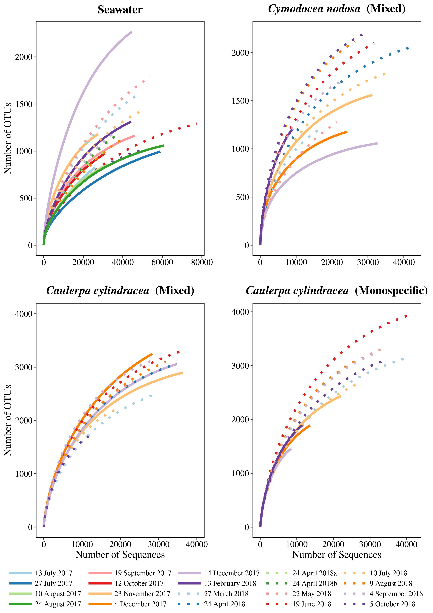
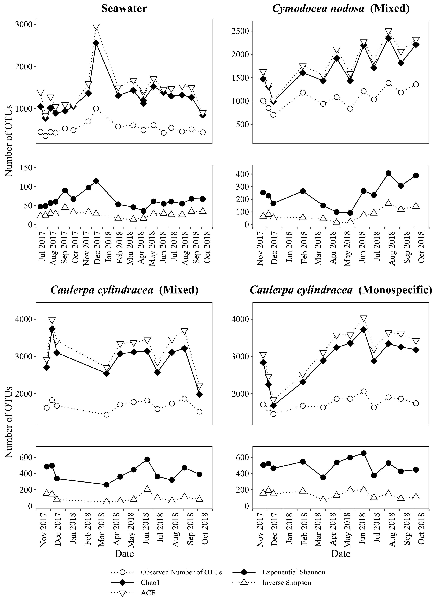

```{r knitr_settings, eval=TRUE, echo=FALSE, cache=FALSE}
opts_chunk$set("tidy" = TRUE)
opts_chunk$set("echo" = FALSE)
opts_chunk$set("eval" = TRUE)
opts_chunk$set("warning" = FALSE)
opts_chunk$set("cache" = FALSE)
opts_chunk$set("message" = FALSE)

inline_hook <- function(x){
	print(x)

	if(is.list(x)){
		x <- unlist(x)
	}

	if(is.numeric(x)){
		if(abs(x - round(x)) < .Machine$double.eps^0.5){
			paste(format(x,big.mark=',', digits=0, scientific=FALSE))
		} else {
			paste(format(x,big.mark=',', digits=1, nsmall=1, scientific=FALSE))
		}
	} else {
    	paste(x)      
	}
}
knitr::knit_hooks$set(inline=inline_hook)
```

\vspace{70mm}

^1$\dagger$^

\vspace{40mm}

$\dagger$ To whom correspondence should be addressed: marino.korlevic@irb.hr


1\. Ruđer Bošković Institute, Center for Marine Research, G. Paliaga 5, Rovinj, Croatia

2\. University of Vienna, Department of Limnology and Bio-Oceanography, Althanstraße 14, Vienna, Austria

\linenumbers
\sisetup{mode=text}
\setlength\parindent{24pt}

## Supplementary Figures
```{r out.width="85%", fig.align="center", fig.cap="Rarefaction curves of bacterial and archaeal communities from the surfaces of macrophytes (\\textit{Cymodocea nodosa} [Invaded] and \\textit{Caulerpa cylindracea} [Invaded and Noninvaded]) and in the surrounding seawater.\\label{rarefaction}", fig.pos="H"}

```

```{r out.width="85%", fig.align="center", fig.cap="Seasonal dynamics of observed number of OTUs, Chao1, ACE, exponential of the Shannon Diversity Index and Inverse Simpson Index of bacterial and archaeal communities from the surfaces of macrophytes (\\textit{Cymodocea nodosa} [Invaded] and \\textit{Caulerpa cylindracea} [Invaded and Noninvaded]) and in the surrounding seawater.\\label{calculators}", fig.pos="H"}

```

```{r out.width="85%", fig.align="center", fig.cap="Relative contribution of chloroplast sequences on the surfaces of macrophytes (\\textit{Cymodocea nodosa} [Invaded] and \\textit{Caulerpa cylindracea} [Invaded and Noninvaded]) and in the surrounding seawater.\\label{chloroplast}", fig.pos="H"}
include_graphics("../results/figures/chloroplast_bar_plot.jpg")
```
